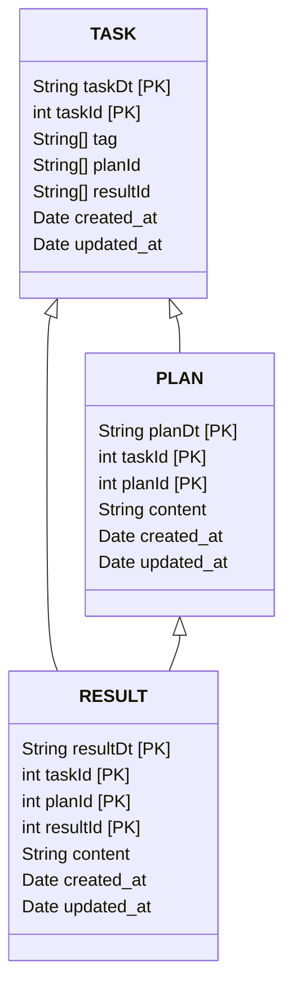

# feather-todo

작업 목록 관리 (★경량)

## 1. 구조

- TASK : 할당받은 작업 내용 기록 (요구사항 단위)
- PLAN : TASK를 일일/Activity 단위로 작업량을 산정/분할하여 작업내용을 계획
- RESULT : 계획한 작업내용(PLAN)을 실제 수행한 내역 작성

```mermaid
classDiagram
    TASK <|-- PLAN
    TASK <|-- RESULT
    PLAN <|-- RESULT

    class TASK {
  		String taskDt [PK]
      int taskId [PK]
      String[] tag
      String[] planId
      String[] resultId
      Date created_at
      Date updated_at
    }

    class PLAN{
  		String planDt [PK]
      int taskId [PK]
      int planId [PK]
			String content
      Date created_at
      Date updated_at

    }
    class RESULT{
  		String resultDt [PK]
      int taskId [PK]
      int planId [PK]
      int resultId [PK]
			String content
      Date created_at
      Date updated_at
    }
```
